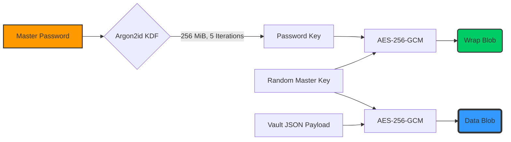

<div align="center">


<p align="center">
  <a href="https://dotnet.microsoft.com/"></a>
  <a href="https://learn.microsoft.com/en-us/dotnet/desktop/wpf/"></a>
  <a href="#"></a>
  <a href="#"></a>
  <a href="https://opensource.org/licenses/MIT"></a>
</p>

<h3 align="center">🔐 Zero-Trace, Hardware-Secured Remote Desktop Engine Engineered for Ultimate Privacy.</h3>

<h2 align="center">
  <a href="#">⬇️ DOWNLOAD LATEST PORTABLE (.EXE) ⬇️</a>
</h2>

<p align="center">
  
</p>

</div>

---

## 🌪️ The Vision

**RDP Vault** is not just another connection manager. It is a **production-grade privacy fortress** built from the ground up in **C# 12 and .NET 9**. 

By orchestrating complex native Windows APIs, advanced cryptography, and aggressive forensic-wiping routines, RDP Vault abstracts the messiness of Windows telemetry into a **lightning-fast, completely portable workflow**. 

Designed specifically to run from a USB drive, it connects you to remote machines via the native `mstsc.exe` and then meticulously purges every registry key, file, and credential trace the moment you disconnect. It boasts zero-dependency deployment and unparalleled security architecture.

---

## 💥 Core Capabilities

> **RDP Vault redefines portable access by treating the host PC as completely untrusted.**

| 🚀 Feature | ✨ Description |
| :--- | :--- |
| **🛡️ Military-Grade Vault** | Your connection profiles are sealed using AES-256-GCM and a master password strengthened by a 256 MiB Argon2id memory-hard KDF. |
| **🧹 Aggressive Trace Sweeper** | The moment an RDP window closes, the app purges Windows Registry histories, UserAssist counters, `Default.rdp`, jump lists, and prefetch files. |
| **👆 Windows Hello Integration** | Supports biometric quick-unlock (fingerprint/face/PIN) physically bound to the host machine's TPM and Data Protection API. |
| **🔌 Dead Man's Switch** | Pull the USB out, and the application instantly locks the vault, sweeps all traces, kills active sessions, and terminates. |
| **⏱️ Dynamic Auto-Relock** | Locks the UI after inactivity to prevent physical tampering, but crucially *keeps existing RDP windows running* without interruption. |

---

## 🧠 Architecture & Innovations

🔹 **In-Memory Credential Injection**  
Passwords never touch the `.rdp` file. RDP Vault utilizes `CredWriteW` to inject volatile `TERMSRV/*` credentials directly into the Windows Credential Manager. These are deleted the exact millisecond the remote session ends.

🔹 **Hardware-Bound Biometric Seals**  
The vault employs DPAPI to wrap the master key with Windows Hello. The cryptographic seal is intrinsically tied to your Windows Account, your PC's hardware, and a SHA-256 verification of the public key blob. Stealing the USB renders the biometrics utterly useless.

🔹 **Fault-Tolerant Atomic Saves**  
Never lose your vault data. RDP Vault employs deterministic atomic file replacements (`.tmp` to `.rdpv`), ensuring that power loss or a yanked USB drive mid-save will never result in file corruption.

🔹 **Single-File Framework-Dependent Deployment**  
Compiled directly as a single portable payload leveraging .NET 9, minimizing footprint while maintaining lightning-fast WPF rendering.

---

## 🔬 Technical Deep Dive

### 1. The Cryptographic Pipeline
RDP Vault constructs a highly secure key hierarchy designed to thwart offline brute force while maintaining instant access.



### 2. The Trace Sweeper
RDP Vault doesn't rely on simple file deletion. It hooks into the Windows Registry and native P/Invoke libraries to completely sanitize the host machine.
- 🔋 **Registry:** Clears all `MRU` history from `Terminal Server Client`.
- ⚡ **Explorer:** Flushes JumpLists and ROT13-encoded `UserAssist` execution counters.
- 📦 **Credentials:** Deep sweeps `TERMSRV/*` from the Credential Manager.

---

## ⚙️ Build Instructions

To compile the application from source, you will need the **.NET 9 SDK**.

```bash
# 1. Clone the repository
git clone https://github.com/your-username/RDP_Encrypt.git
cd RDP_Encrypt

# 2. Publish as a Single Portable Executable
dotnet publish RDPVault/RDPVault.csproj -c Release -r win-x64 -p:PublishSingleFile=true -o publish
```

> **💡 Pro Tip:** The final portable executable will be located in `.\publish\RDPVault.exe`. Simply copy this to your encrypted USB drive.

---

## 🛡️ License & Limits

Engineered for extreme privacy. Released under the **MIT License**.

**Honest security limits:**
- It protects against local forensic discovery and offline brute-force attacks on the vault. 
- It *does not* hide network traffic beyond standard RDP protocols, nor does it wipe server-side logs on the machine you connect to. 
- If an attacker compromises your unlocked Windows session locally, your vault is vulnerable. Lock your PC (`Win+L`).

<div align="center">
  <br>
  <i>"Privacy is not an option, it's the default."</i>
  <br><br>
  
</div>